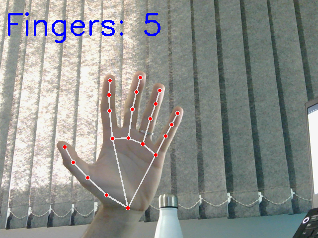

# **Hand Detection and Finger Counting with OpenCV and MediaPipe**

*This Python code uses OpenCV and MediaPipe to detect and count raised fingers in real time through a webcam feed.*

## **Code Summary**

-   **Initialize MediaPipe Hand Detection**: Sets up MediaPipe's hand detection model and drawing utilities.
    Open Webcam Feed: Captures video from the camera (set to camera index 2), with a resolution of 640x480 and 30 FPS.

-   **Hand Detection and Counting**:
    -   Converts each frame to RGB for processing by MediaPipe.
    -   Detects hand landmarks, assigns hand side (left or right), and draws landmarks on the image.
    -   Counts raised fingers using coordinates of landmarks for each detected hand.
    -   Displays the count on the screen.
-   **Run Loop**: Continuously processes video frames to update hand detection and finger count.
    
-    **Exit**: Ends the loop and releases the camera when 'ESC' is pressed.

### Usage

    1°- Ensure OpenCV and MediaPipe are installed in your virtual environment.
        Run "pip install -r requirements.txt" in your terminal
    2°- Run the script; it will display the live feed with hand detection and finger counting.
    3°- Press 'ESC' to close.
